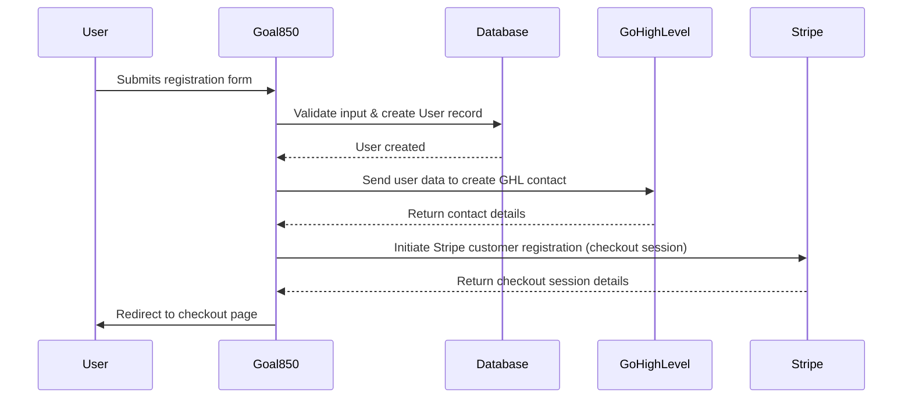
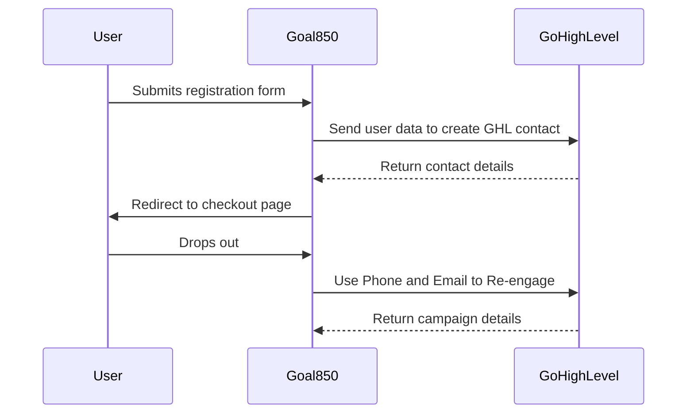

# Notes

What I'm seeing is the check out is requiring a user first and that seems unintuitive.

I'm trying to register incrementally, in steps

- step one
  - being create the user based on first name last name, phone number email and password
  - this will at least create the user
  - when successful and able to move on send this data to GHL (go high level) to create a contact
  - then send the user to the check out page

- step two
  - is when they're sent to the check out page

- step three
  - this is when they're redirected back to the site based on what they did
  - successful - dashboard
  - failed - meaning they didn't make the payment or had errors

## Stripe listen to webhooks

```bash
stripe listen --forward-to <http://goal850.test/stripe/webhook
```



---

## if the user drops out after the step 1, create a drip campaign to reengage them


