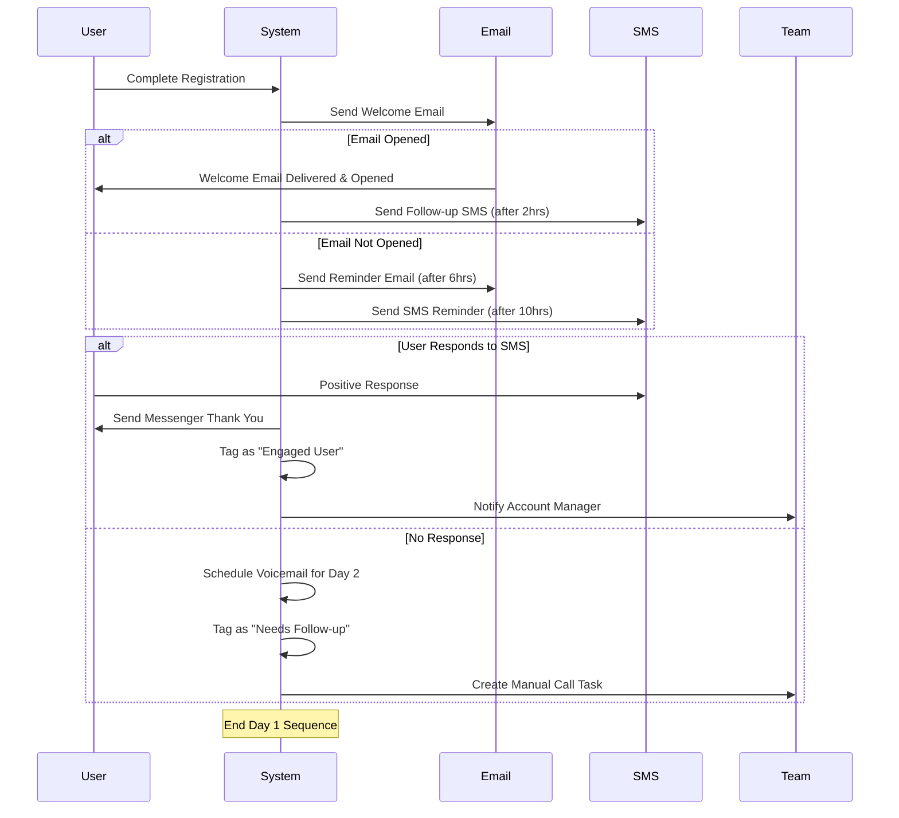

# Goal850

Project:

I have a funnel of "Loan Declines" and they are going to be put into a spreedsheet and uploaded to go highlevel.

at this point, I want go highlevel to use the trigger 'Create Contact' to start the automation.

this is where i need help with coming up with a Marketing Strategy to get the leads to convert.

I want a Golden Path where say yes to everything, but a drip campaign for those that say no.
use Mermaid to convay this information and show a flowchart and also show in detail the mindset of why this is the best path to take.

the main goal is to get the leads to convert and to make the most money possible.

We'll have affiliates and we'll have a marketing strategy to get the leads to convert.

I'm not fully clear on the marketing strategy, but I know that I want to use go highlevel to automate the process.

## login

useing shadcn-vue make a login with email password using those components

## Registration (Wizard)

### Step 0 - Landing Page

- [ ] User can click on the "Get Started" button
- [ ] User is redirected to the registration page

### Wizard Step 1 - Registration

- [ ] 1. (Wizard step 1) User can enter their email and password (with optional email new letter)
  - [ ] 1.a email
  - [ ] 1.b password
  - [ ] 1.d first name
  - [ ] 1.e last name
  - [ ] 1.f phone number
  - [ ] 1.g optional email newsletter

#### Add to (Registration Drip Campaign)

- [ ] ghl.1.a - create contact
- [ ] ghl.1.b - add contact tag
- [ ] ghl.1.c - starts a drip campaign (see: "Registration Drip Campaign")
  - [ ] ghl.1.c.1 - send welcome email
  
### Wizard Step 2 - Payment

- [ ] 2. (Wizard step 2) Select Plan and enter Credit Card
- [ ] 2.a select a plan
- [ ] 2.b apply discount code
- [ ] 2.c enter credit card information

#### Create Array Account

#### Update (Registration Drip Campaign)

- [ ] ghl.2.a - status update to "Customer"

### Wizard Step 3 - Redirect to Dashboard

- [ ] 3. Send to Welcome Page with simple next steps
- [ ] 3.a send to welcome page
  - [ ]3.a.1 Congrats on signing up
    - [ ]3.a.2 Next steps
      - [ ]3.a.3 Setup Array account
  

## Campaigns

### Registration Drip Campaign

- [ ] 1. (Day 1) Welcome email

### Day 1: Welcome Sequence Details

1. **Initial Welcome Email** (Immediate)
   - Personalized welcome message
   - Account activation confirmation
   - Quick overview of key features
   - Clear CTA to complete profile

2. **SMS Follow-up** (2 hours after email open OR 10 hours after registration if email not opened)
   - Brief welcome message
   - Link to mobile-friendly quick start guide
   - Invitation to respond with questions

3. **Engagement Follow-ups** (Based on response)
   - If engaged: Send messenger thank you and assign to account manager
   - If not engaged: Schedule voicemail for next day and create follow-up task

4. **Internal Processes**
   - Tag contacts based on engagement level
   - Create appropriate team notifications
   - Set up next day's automation path

This approach uses multiple channels strategically rather than bombarding the user, and creates different paths based on engagement to maximize conversion while maintaining a positive user experience.
